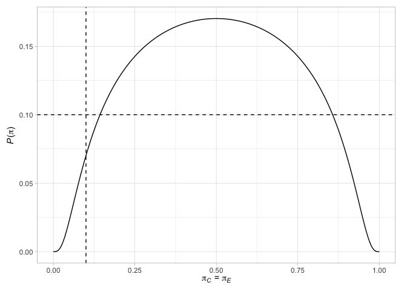
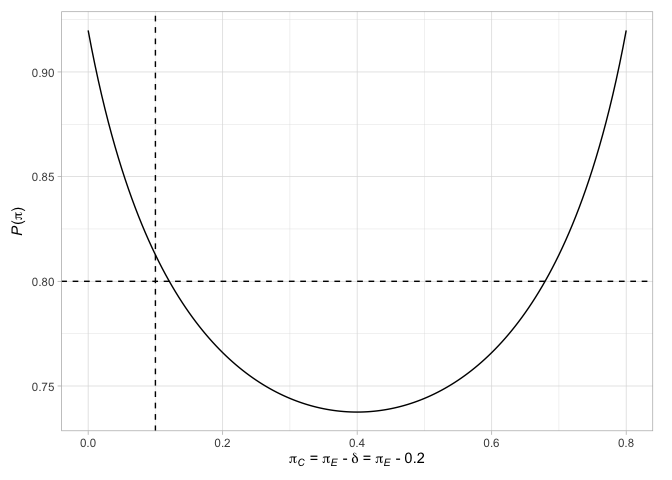

<!-- README.md is generated from README.Rmd. Please edit that file -->

# ph2rand 

*Randomized Phase II Oncology Trials with Bernoulli Outcomes*

## Description

**ph2rand** provides functions to assist with the design of randomized
comparative phase II oncology trials that assume their primary outcome
variable is Bernoulli distributed. Specifically, support is provided to
(a) perform a sample size calculation when using one of several
published designs (Jung, 2008; Jung and Sargent, 2014; Kepner, 2010;
Litwin *et al*, 2017, Shan *et al*, 2013), (b) evaluate the operating
characteristics of a given design (both analytically and via
simulation), and (c) produce informative plots.

## Getting started

You can install the the latest development version of **ph2rand**,
available from [GitHub](https://github.com/), with

``` r
devtools::install_github("mjg211/ph2rand")
```

An introductory example of how to make use of the package’s core
functionality can be found below. For further help, please see the
package vignettes or email <michael.grayling@newcastle.ac.uk>.

## Example: Two-stage designs

We demonstrate functionality for two-stage designs, with the approach
for single-stage designs being similar. First, find a two-stage design
from Jung (2008) for the default parameters

``` r
des_jung <- des_two_stage()
```

Then examine its required sample size in each arm, in each stage

``` r
des_jung$nC
#> [1] 17 17
des_jung$nE
#> [1] 17 17
```

Next, look at its key operating characteristics

``` r
des_jung$opchar
#> # A tibble: 2 x 13
#>     piC   piE `P(pi)` `ESS(pi)` `SDSS(pi)` `MSS(pi)` `E1(pi)` `E2(pi)` `F1(pi)`
#>   <dbl> <dbl>   <dbl>     <dbl>      <dbl>     <dbl>    <dbl>    <dbl>    <dbl>
#> 1   0.1   0.1  0.0702      47.0       16.5        34        0   0.0702   0.617 
#> 2   0.1   0.3  0.813       64.7       10.1        68        0   0.813    0.0972
#> # … with 4 more variables: `F2(pi)` <dbl>, `S1(pi)` <dbl>, `S2(pi)` <dbl>, `max
#> #   N` <int>
```

Compare this to the equivalent design from Litwin *et al* (2017)

``` r
des_litwin_et_al <- des_two_stage(type  = "sat",
                                  nCmax = 20L)
des_litwin_et_al$nC
#> [1] 10 10
des_litwin_et_al$nE
#> [1] 10 10
des_litwin_et_al$opchar
#> # A tibble: 2 x 13
#>     piC   piE `P(pi)` `ESS(pi)` `SDSS(pi)` `MSS(pi)` `E1(pi)` `E2(pi)` `F1(pi)`
#>   <dbl> <dbl>   <dbl>     <dbl>      <dbl>     <dbl>    <dbl>    <dbl>    <dbl>
#> 1   0.1   0.1   0.100      25.2       8.79        20        0    0.100    0.739
#> 2   0.1   0.3   0.804      36.9       7.20        40        0    0.804    0.153
#> # … with 4 more variables: `F2(pi)` <dbl>, `S1(pi)` <dbl>, `S2(pi)` <dbl>, `max
#> #   N` <int>
```

Now to that from Shan (2013)

``` r
des_shan_et_al <- des_two_stage(type  = "barnard",
                                nCmax = 40L)
des_shan_et_al$nC
#> [1] 17 17
des_shan_et_al$nE
#> [1] 17 17
des_shan_et_al$opchar
#> # A tibble: 2 x 13
#>     piC   piE `P(pi)` `ESS(pi)` `SDSS(pi)` `MSS(pi)` `E1(pi)` `E2(pi)` `F1(pi)`
#>   <dbl> <dbl>   <dbl>     <dbl>      <dbl>     <dbl>    <dbl>    <dbl>    <dbl>
#> 1   0.1   0.1  0.0968      47.0       16.5        34        0   0.0968   0.617 
#> 2   0.1   0.3  0.800       64.7       10.1        68        0   0.800    0.0977
#> # … with 4 more variables: `F2(pi)` <dbl>, `S1(pi)` <dbl>, `S2(pi)` <dbl>, `max
#> #   N` <int>
```

And finally that from Jung and Sargent (2014)

``` r
des_jung_sargent <- des_two_stage(type  = "fisher")
des_jung_sargent$nC
#> [1] 22 22
des_jung_sargent$nE
#> [1] 22 22
des_jung_sargent$opchar
#> # A tibble: 2 x 13
#>     piC   piE `P(pi)` `ESS(pi)` `SDSS(pi)` `MSS(pi)` `E1(pi)` `E2(pi)` `F1(pi)`
#>   <dbl> <dbl>   <dbl>     <dbl>      <dbl>     <dbl>    <dbl>    <dbl>    <dbl>
#> 1   0.1   0.1  0.0530      61.5       21.5        44        0   0.0530   0.602 
#> 2   0.1   0.3  0.808       85.2       10.7        88        0   0.808    0.0627
#> # … with 4 more variables: `F2(pi)` <dbl>, `S1(pi)` <dbl>, `S2(pi)` <dbl>, `max
#> #   N` <int>
```

We can then readily find the terminal points of any of these designs,
along with their probability mass functions and operating
characteristics for any true response rates. For example, consider two
scenarios given by

``` r
pi <- rbind(c(0.1, 0.1),
            c(0.1, 0.3))
```

Then find the terminal points, probability mass functions, and operating
characteristics (both analytically and via simulation) of the Jung
(2008) design with

``` r
terminal_jung <- terminal(des_jung)
terminal_jung$terminal
#> # A tibble: 1,344 x 7
#>       xC    xE    mC    mE statistic decision            k    
#>    <int> <int> <int> <int>     <int> <fct>               <fct>
#>  1     0     0    17    17         0 Do not reject       1    
#>  2     0     1    17    17         1 Continue to stage 2 1    
#>  3     0     2    17    17         2 Continue to stage 2 1    
#>  4     0     3    17    17         3 Continue to stage 2 1    
#>  5     0     4    17    17         4 Continue to stage 2 1    
#>  6     0     5    17    17         5 Continue to stage 2 1    
#>  7     0     6    17    17         6 Continue to stage 2 1    
#>  8     0     7    17    17         7 Continue to stage 2 1    
#>  9     0     8    17    17         8 Continue to stage 2 1    
#> 10     0     9    17    17         9 Continue to stage 2 1    
#> # … with 1,334 more rows
pmf_jung      <- pmf(des_jung, pi)
pmf_jung$pmf
#> # A tibble: 2,382 x 10
#>      piC   piE    xC    xE    mC    mE statistic decision      k     `f(x,m|pi)`
#>    <dbl> <dbl> <int> <int> <int> <int>     <int> <fct>         <fct>       <dbl>
#>  1   0.1   0.1     0     0    17    17         0 Do not reject 1          0.0278
#>  2   0.1   0.1     1     0    17    17        -1 Do not reject 1          0.0525
#>  3   0.1   0.1     1     1    17    17         0 Do not reject 1          0.0992
#>  4   0.1   0.1     2     0    17    17        -2 Do not reject 1          0.0467
#>  5   0.1   0.1     2     1    17    17        -1 Do not reject 1          0.0882
#>  6   0.1   0.1     2     2    17    17         0 Do not reject 1          0.0784
#>  7   0.1   0.1     3     0    17    17        -3 Do not reject 1          0.0259
#>  8   0.1   0.1     3     1    17    17        -2 Do not reject 1          0.0490
#>  9   0.1   0.1     3     2    17    17        -1 Do not reject 1          0.0436
#> 10   0.1   0.1     3     3    17    17         0 Do not reject 1          0.0242
#> # … with 2,372 more rows
opchar_jung   <- opchar(des_jung, pi)
opchar_jung$opchar
#> # A tibble: 2 x 13
#>     piC   piE `P(pi)` `ESS(pi)` `SDSS(pi)` `MSS(pi)` `E1(pi)` `E2(pi)` `F1(pi)`
#>   <dbl> <dbl>   <dbl>     <dbl>      <dbl>     <dbl>    <dbl>    <dbl>    <dbl>
#> 1   0.1   0.1  0.0702      47.0       16.5        34        0   0.0702   0.617 
#> 2   0.1   0.3  0.813       64.7       10.1        68        0   0.813    0.0972
#> # … with 4 more variables: `F2(pi)` <dbl>, `S1(pi)` <dbl>, `S2(pi)` <dbl>, `max
#> #   N` <int>
sim_jung      <- sim(des_jung, pi)
sim_jung$sim
#> # A tibble: 2 x 13
#>     piC   piE `P(pi)` `ESS(pi)` `SDSS(pi)` `MSS(pi)` `E1(pi)` `E2(pi)` `F1(pi)`
#>   <dbl> <dbl>   <dbl>     <dbl>      <dbl>     <dbl>    <dbl>    <dbl>    <dbl>
#> 1   0.1   0.1  0.0727      47.0       16.5        34        0   0.0727   0.617 
#> 2   0.1   0.3  0.815       64.7       10.0        68        0   0.815    0.0961
#> # … with 4 more variables: `F2(pi)` <dbl>, `S1(pi)` <dbl>, `S2(pi)` <dbl>, `max
#> #   N` <int>
```

Finally, we can plot various factors relating to the designs. For
example, plot the terminal points of the Jung (2008) design (with their
associated decisions), along with the probability of rejecting the null
hypothesis when the response probabilities are equal in the two arms or
when the difference in the response probabilities is the chosen
treatment effect

``` r
plot(des_jung)
```



See the package vignettes for further details.

## References

Jung SH (2008) Randomized phase II trials with a prospective control.
*Stat Med* 27(4):568–83. DOI:
[10.1002/sim.2961](https://doi.org/10.1002/sim.2961). PMID:
[17573688](https://pubmed.ncbi.nlm.nih.gov/17573688).

Jung SH, Sargent DJ (2014) Randomized phase II clinical trials. *J
Biopharm Stat* 24(4):802–16. DOI:
[10.1080/10543406.2014.901343](https://doi.org/10.1080/10543406.2014.901343).
PMID: [24697589](https://pubmed.ncbi.nlm.nih.gov/24697589).

Kepner JL (2010) On group sequential designs comparing two binomial
proportions. *J Biopharm Stat* 20(1):145–59. DOI:
[10.1080/10543400903280621](https://doi.org/10.1080/10543400903280621).
PMID: [20077254](https://pubmed.ncbi.nlm.nih.gov/20077254).

Litwin S, Basickes S, Ross EA (2017) Two-sample binary phase 2 trials
with low type I error and low sample size. *Stat Med* 36(9):1383–94.
DOI: [10.1002/sim.7226](https://doi.org/10.1002/sim.7226). PMID:
[28118686](https://pubmed.ncbi.nlm.nih.gov/28118686).

Shan G, Ma C, Hutson AD, Wilding GE (2013) Randomized two-stage phase II
clinical trial designs based on Barnard’s exact test. *J Biopharm Stat*
23(5):1081–90. DOI:
[10.1080/10543406.2013.813525](https://doi.org/10.1080/10543406.2013.813525).
PMID: [23957517](https://pubmed.ncbi.nlm.nih.gov/23957517).
